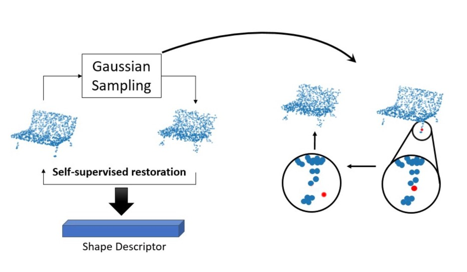
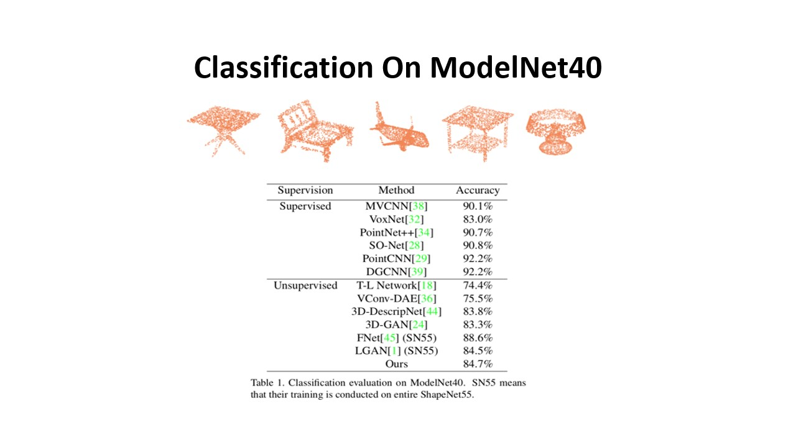
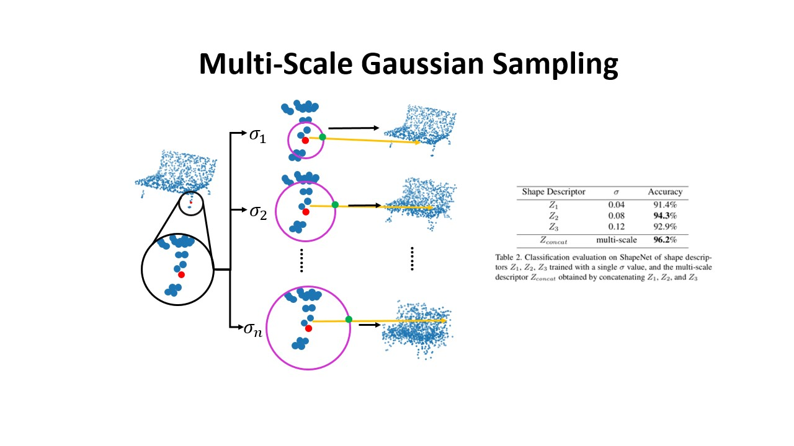
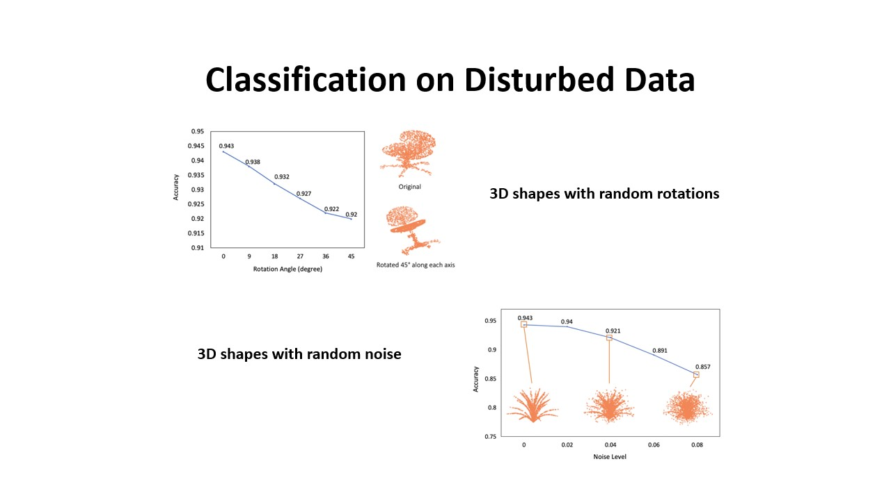
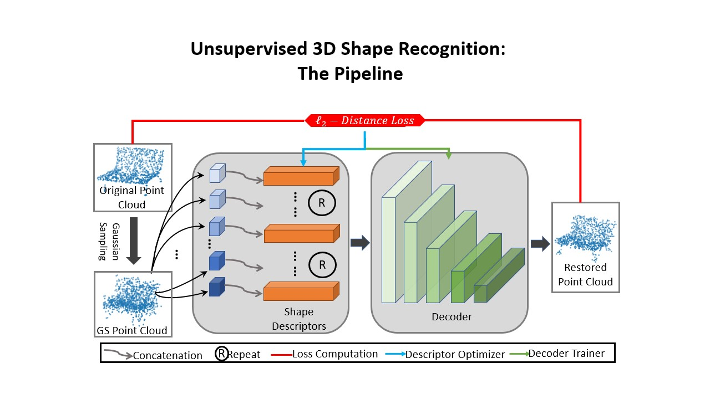

# Unsupervised Deep Shape Descriptor with Point Distribution Learning 
&nbsp; &nbsp;This repository contains sampling code for the 'Unsupervised Deep Shape Descriptor with Point Distribution Learning'. This README file contains data details and important infomation for training and testing. The code has just been reoredered and separated from another project. This is my first paper, and I believe it can be improved and finalized in a better shape. I hope this repo can be helpful for those want to run the method on customized settings. Please make a post in Issues if you have encountered any problem.

Useful Links
----------------
### [Paper](https://drive.google.com/open?id=1OjtTes9h4y1X0_yZNrWCmUTsuXgI4Ev)&nbsp;
### [Slides](https://drive.google.com/open?id=14K5LHh_mtf7znlY2Re83OcQicpG-eF1C)&nbsp;
### [Teaser](https://drive.google.com/open?id=1cSuHC03yJhB2QISNpjMzAtYVPydVXkqi)&nbsp;
### [Lab](https://wp.nyu.edu/mmvc/publications/)

## Overview
&nbsp; &nbsp;This work focuses on unsupervised 3D point cloud descriptor/feature computation. The proposed learning based approach treats each point as a Gaussian and introduces an operation called 'Gaussian Sampling' which applies multiple 'disruptions' to each point. Then an auto-decoder model is leveraged to model a Maximum Likelihood Estimation process where the parameters of each point Gaussian are predicted. (i.e guess the mean which is also the original location of each point), through which the geometric information of the shape is learned. On the other hand, it can also be viewed as a non rigid self-registration process.
    

   
## Data and Experiment
&nbsp; &nbsp; On contrary to using the entire 55 categories and 57,000 data that forms Shapenet55 from [ShapeNet](https://www.shapenet.org/) for training the model, we follow the setting as in [3DGAN](http://3dgan.csail.mit.edu/) where only seven categories from the [ShapeNet](https://www.shapenet.org/) are used in training. The evaluation is done on the ModelNet40 benchmark. We provide processed partial data in the following link:

Training: [A subset](https://drive.google.com/open?id=1Pmu9e70uKBvxgBYbjU8GxuzLY3xWPc0x) consists of 7 categories from ShapeNet.    
Evaluation: [ModelNet40 Aligned](https://modelnet.cs.princeton.edu/)  

In the ablation study (reconstruction, multiscale, roatation & noise invariance), the model is trained on 7 major categories from ShapeNet. The experiment is then conducted on a [ShapeNet](https://drive.google.com/open?id=1Pmu9e70uKBvxgBYbjU8GxuzLY3xWPc0x) evaluationn set. The evaluation for classification uses a train/test split of 8:2. The classifier used in the final evaluation of computed descriptors is an MLP.

Training and testing Details
----------------------
&nbsp; &nbsp; Given the nature of our encoder-free decoder structure, both the decoder network and the descriptors are computed in an optimization manner. Therefore, the entire pipline involves two phases: decoder model training and descriptor computation. 

During model training, we use 7 major categories from ShapeNet. Beware that the learning rate for the descriptors should be higher than that with the decoder so that descriptors are forced to capture information rather than overfitting the decoder model itself.    
   
During descriptor computation, the descriptors obtained in the previous model training will be discarded. The learning rate of the descriptor will be set higher than previous stage for fast convergence while the model parameters remain fixed. 

For each dataset involved, the hyper parameters should be tuned for the optimal performance. The evaluation over generated descriptors is performed with the default function provided by sklearn. 

Dependencies
-----------------
We used Pytorch 1.3 for our model implementation. 

-pytorch 

-matplotlib 

-numpy 

-sklearn 

-open3d  

-tqdm 

Reference
---------------
@InProceedings{Xu_Shi_2020_CVPR,  
&nbsp; &nbsp;author = {Shi, Yi and Xu, Mengchen and Yuan, Shuaihang and Fang, Yi},  
&nbsp; &nbsp;title = {Unsupervised Deep Shape Descriptor With Point Distribution Learning},  
&nbsp; &nbsp;booktitle = {The IEEE/CVF Conference on Computer Vision and Pattern Recognition (CVPR)},  
&nbsp; &nbsp;month = {June},  
&nbsp; &nbsp;year = {2020}  
}

